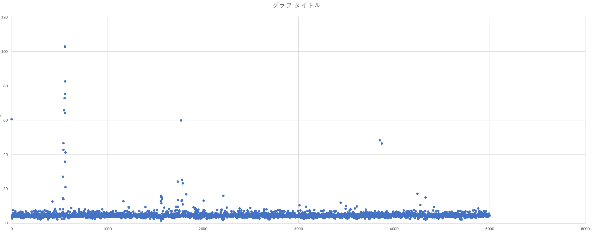
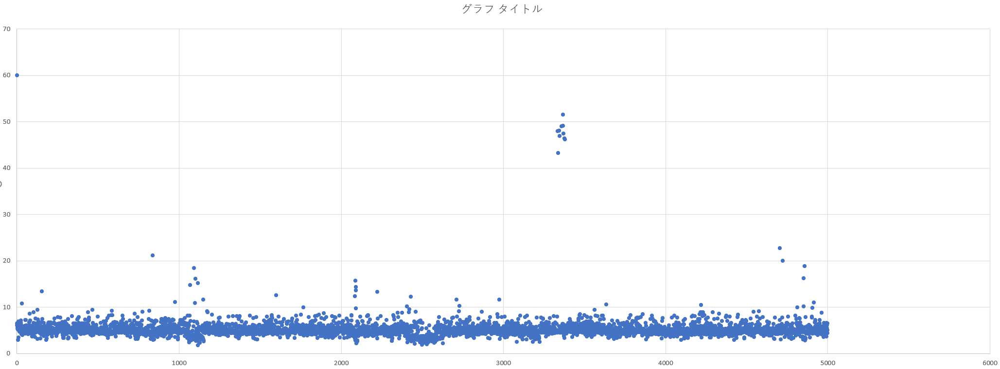

# ADO
## 環境

IRIS データベースバッファサイズ: 2048MB  
Windows版:IRIS for Windows (x86-64) 2021.2.1 (Build 654U) Fri Mar 18 2022 06:09:35 EDT  
コンテナ版:IRIS for UNIX (Ubuntu Server LTS for x86-64 Containers) 2021.2 (Build 651U) Mon Jan 31 2022 18:07:01 EST

## 実行方法

ADO.exe SleepTime(ms) host port

```
> ADO.exe 100 192.168.11.2 1972
```

## 結果
Windows10ホスト(ADO Client用)から物理的に別のWindows10ホスト上のIRISサーバに対して実行。
> (注意)使用環境は計測に「理想」とは言えない環境なので、傾向を把握することが目的としている。  
> 通信はWi-Fi経由。クライアント、サーバ共にセキュリティ対策ソフトあり。

|IRIS環境|計測値|備考|
|:---|:---|:---|
|Windows版IRIS|[実行結果](results/sleep100-win.txt)||
|コンテナ版(同Windows上のWSL2)|[実行結果](results/sleep100-docker.txt)||

Windows版散布図

|

コンテナ版散布図

|
## how to forward wsl2 port to an external host.

```
netsh.exe interface portproxy add v4tov4 listenaddress=192.168.11.2 listenport=1972 connectaddress=172.25.29.22 connectport=1972
```
