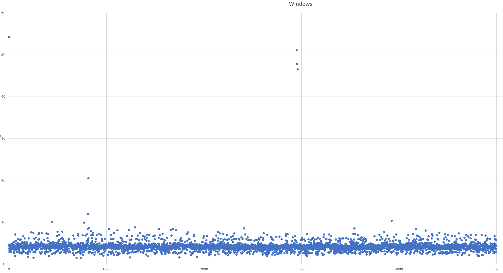
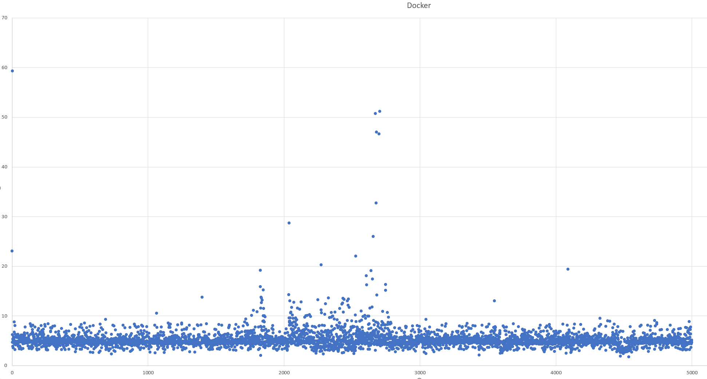

# ADO
## 環境

IRIS データベースバッファサイズ: 2048MB  
Windows版:IRIS for Windows (x86-64) 2021.2.1 (Build 654U) Fri Mar 18 2022 06:09:35 EDT  
コンテナ版:IRIS for UNIX (Ubuntu Server LTS for x86-64 Containers) 2021.2 (Build 651U) Mon Jan 31 2022 18:07:01 EST

## 処理内容
テーブルを3つ作成し、下記を指定回数分繰り返す。
INSERT TestTable
INSERT TestTable2
SELECT COUNT(*) FROM INSERT TestTable WHERE ...
INSERT TestTable3

## 実行方法

ADO.exe SleepTime(ms) host port


```
> ADO.exe 100 192.168.11.2 1972 
> ADO.exe 100 192.168.11.2 1972 > result.txt
```
初回実行時は、クエリプランの作成、データベースの拡張などが伴う可能性があるため、2回目以降を計測すること。
1回目の統計情報を消去するために、1回目の実行の直後に、クエリの統計情報をクリアしておく。


## 計測結果の例
Windows10ホスト(ADO Client用)から物理的に別のWindows10ホスト上のIRISサーバに対して実行。
> (注意)使用環境は計測に「理想」とは言えない環境なので、傾向を把握することが目的としている。  
> 通信はWi-Fi経由。クライアント、サーバ共にセキュリティ対策ソフトあり。

2ホスト間の遅延発生具合は下記の通り。
```
>ping 192.168.11.2
192.168.11.2 に ping を送信しています 32 バイトのデータ:
192.168.11.2 からの応答: バイト数 =32 時間 =2ms TTL=128
192.168.11.2 からの応答: バイト数 =32 時間 =3ms TTL=128
192.168.11.2 からの応答: バイト数 =32 時間 =2ms TTL=128
192.168.11.2 からの応答: バイト数 =32 時間 =3ms TTL=128

192.168.11.2 の ping 統計:
    パケット数: 送信 = 4、受信 = 4、損失 = 0 (0% の損失)、
ラウンド トリップの概算時間 (ミリ秒):
    最小 = 2ms、最大 = 3ms、平均 = 2ms
```
### 計測値

|IRIS環境|計測値|備考|
|:---|:---|:---|
|Windows版IRIS|[実行結果](results/sleep100-win.txt)||
|コンテナ版(同Windows上のWSL2)|[実行結果](results/sleep100-docker.txt)||

### Windows版散布図

|

### コンテナ版散布図

|

### SQL統計の確認手順
$ docker-compose exec iris iris session iris "UpdateSQLStats^%SYS.SQLSRV()"

## how to forward wsl2 port to an external host.

```
netsh.exe interface portproxy add v4tov4 listenaddress=192.168.11.2 listenport=1972 connectaddress=172.25.29.22 connectport=1972
```
